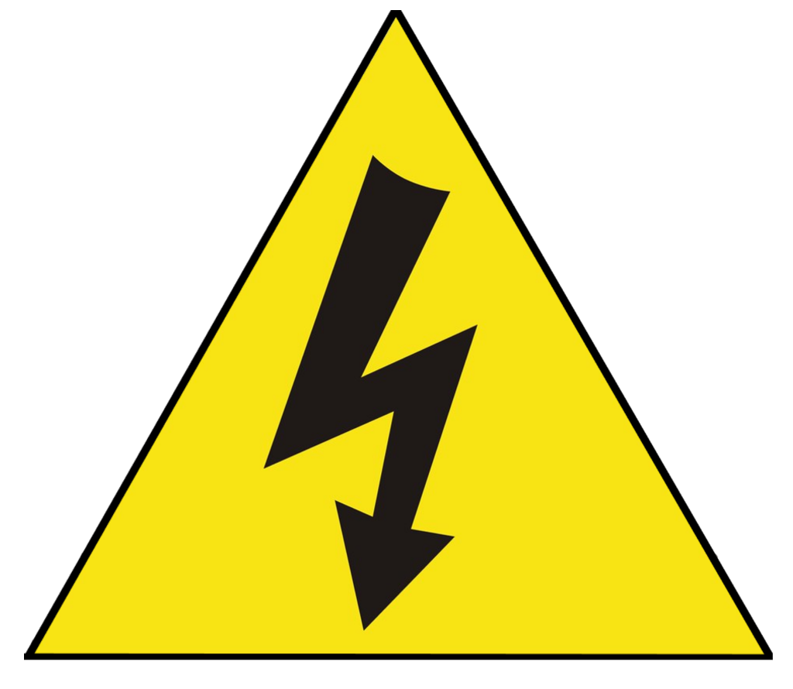
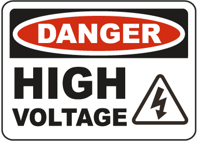

# Jacob´s Ladder 

  
### Author
Jorge Miguel González Novez  |  _Technician in Electrotechnical and Automated Systems_

### Wiring diagrams and images  
- [Wiring](./docs/wiring.pdf)  
- [Images](./images)

### Materials  

- [Materials](./docs/materials.md)

### Operating Instructions  

- [Operating instructions](./docs/operating-instructions.md)

### Liability

**I am not responsible for the inappropriate use of the information shown here.  
As well as for any accident caused by the incorrect use of the materials and/or tools.  
Electricity is not a game.  
Always follow the 5 golden rules.**

 
  
### Software licenses

 

<https://www.autodesk.com/education/free-software/autocad?_ga=2.186529646.677273030.1597095859-477852678.1596981201>  
