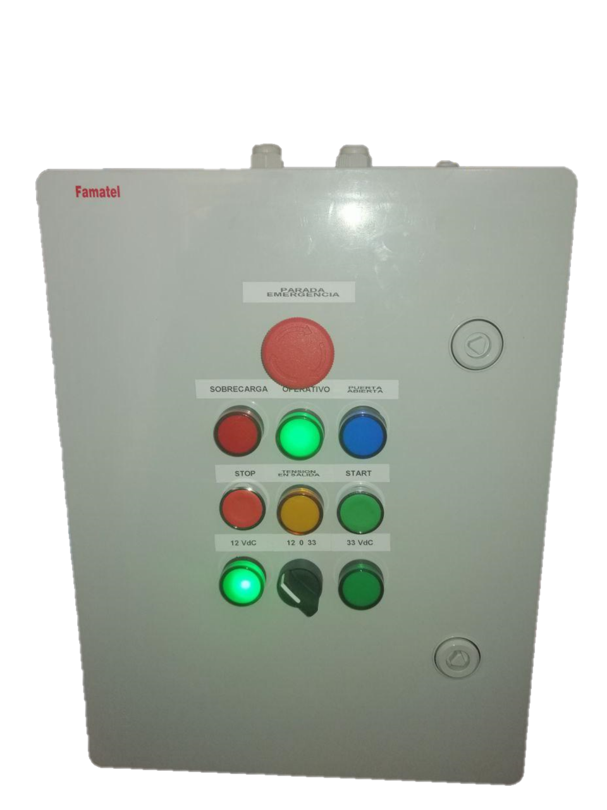
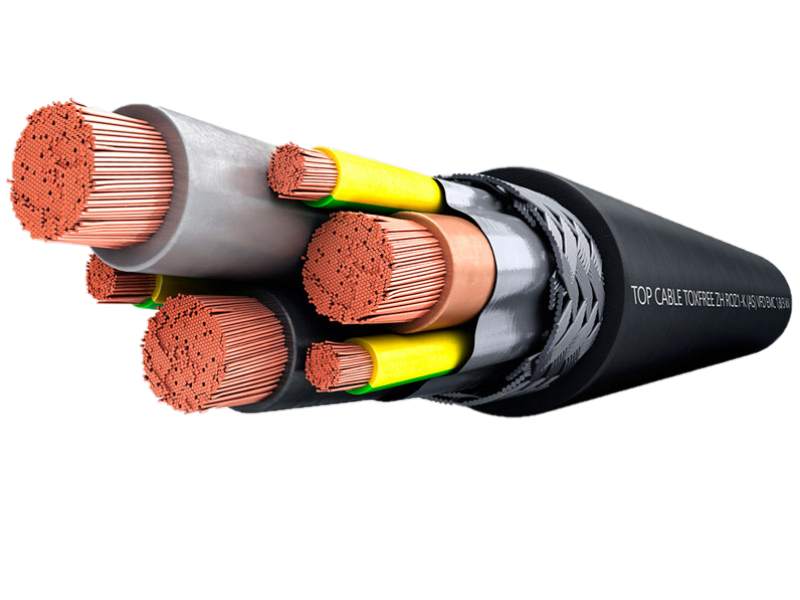
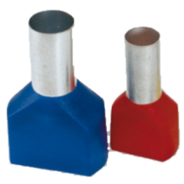
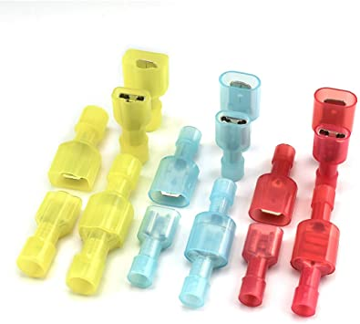
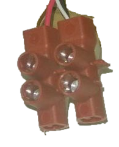
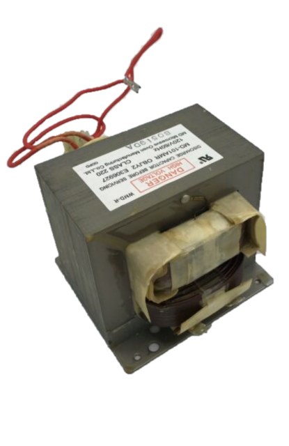
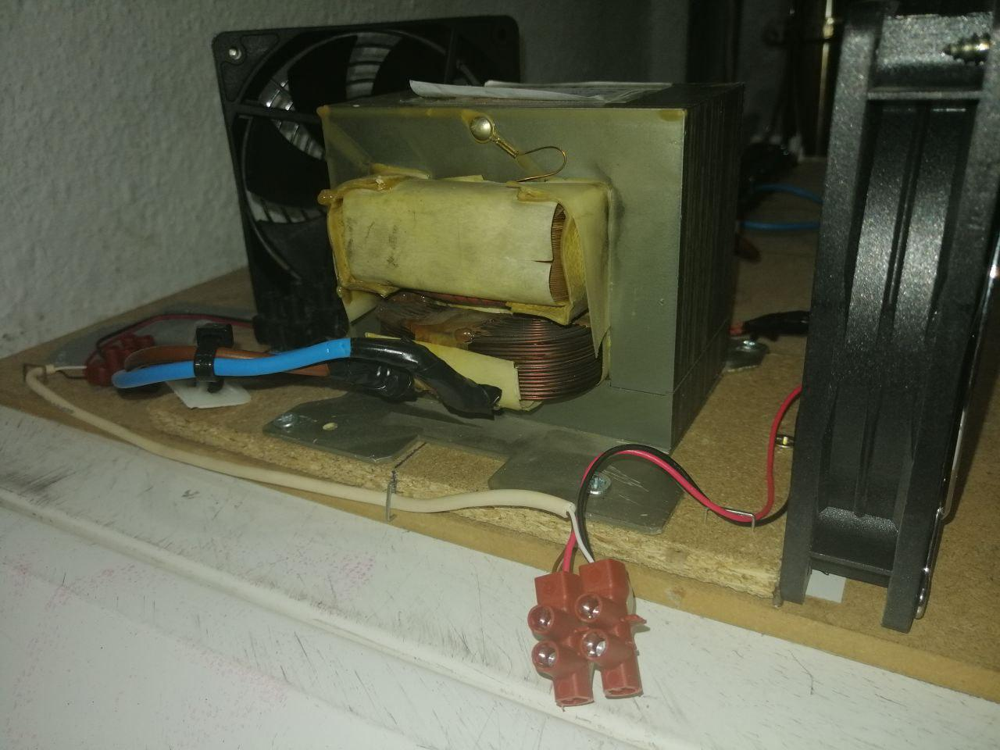

# Materials

- 1 x [Test Equipment Enclosure](https://github.com/jorgemgn/test-equipment-enclosure)  
    

- Wire:  
    
    - 1 x 2m 2,5mm2 black phase wire  
    - 1 x 2m 2,5mm2 blue neutral wire  
    - 1 x 2m 2,5mm2 green-yellow protection wire  
    - 1 x 2m 0,75mm2 black negative wire  
    - 1 x 2m 0,75mm2 red positive wire 
    
    *Instead of single-pole cables, it is recommended to use cable hoses*    
    
- Wire insulated ferrules: (*optional*) 
      
    - 1 x 10 0,75mm2 
    - 1 x 10 2,5mm2  

- 1 x Terminal Blocks  
   

- 1 x Microwave Transformer  
    

- 2 x 12VdC fan to cool the transformer (*optional*)  
  
  
- 1 x Labeller  

