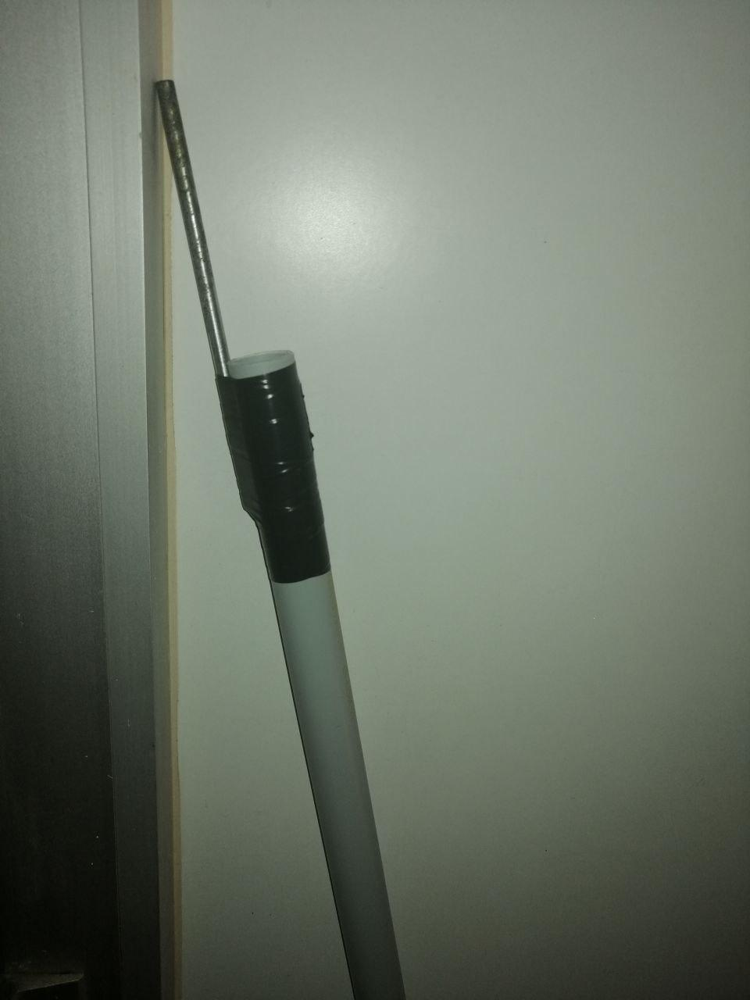
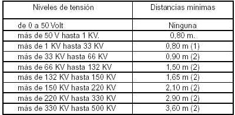

# Operating Instruction

<H1 align="center"> ⚠️read carefully⚠️ </H1>

- The control panel assembly consists of a direct starter used for the motors.  
- As safety elements, in the control circuit, we have the **emergency switch**, the stop button and the overload relay.  
- Furthermore, as an additional safety to prevent direct contact with the conductors, the panel has a limit switch that detects when the door is open, stopping the entire power system.  
- For the direct start, it is enough to verify that none of the safety measures mentioned above are active, and we will only have to press the start button.  
- In the upper part of the cabinet there are cable glands through which we will take out the cables to connect the receptors.  
- **The system does not have residual current protection, so we will have to feed it from a panel that does have residual current protection.**
- The use of the transformer involves a **high risk**, as we are working with voltages of the order of **2.000V**. 
- Microwave transformers have one of the terminals of the secondary coil welded to the core, so it **is strictly forbidden to touch or approach the core when the transformer is working**.
- To be able to start the electric arc on Jacob's ladder, **we must use a metal element properly insulated in the grip area**. For example, we can place a **nail at the end of a PVC pipe**.  
      
- If the voltage exceeds 4.000V, the arc is generated by itself without the need for us to create it.
